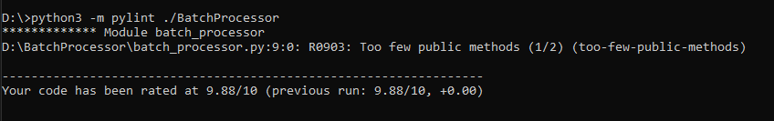

> This is the new version of BatchProcessor
# BatchProcessor System
This system helps to generate batches according to given limitation.
## What's new in this new version ?
After getting useful feedbacks, I decided to change the project according to given feedback.
* Old version didn't contain any unit testing module (Test function was written manually). However, new version is using **unittest** testing library for unit testing. I also created *TestSuite* in the project.
    > You can run all test cases from *test_runner.py*
* More readable and clean code. I tried to decrease line of codes, unnecessary comments and unused imports.
* After several research about Python coding language. I found this styling guide https://peps.python.org/pep-0008/ and I tried to follow this style while re-developing the new version.
* I also discover *pylint* for analysing the python project. Here you can see current rate score

* I decided to remove *Logging* feature from the project because it wasn't useful as I expected.
* *Input Record Generator* also has been changed

## BatchProcessor
* This class helps to split records into the batch for continuous data-delivering systems
* Algorithm splits records linearly and group them into batches according to batch and record limitations
* This system doesn't contain **cache** system because *order of records shouldn't be interrupted*

## Default Limitation Values
* Maximum size of output record is **1MB**
* Maximum size of output batch is **5MB**
* Maximum number of recrods in an output batch is **500**
> You can edit these values in config/byte_size_constant file

## Input Record Generator
* It helps to generate new record list and record data for testing
* It contains 2 methods which they are *input_record_generator()* and *generate_single_record*

## Testing
* Testing is completely changed. New version is using **unittest** library for unit testing.
* There are 5 test method for testing different cases.
* There are also **TestSuite** implementation in the project. Therefore, new test classes and methods can easily be implemented thanks to *TestSuite*